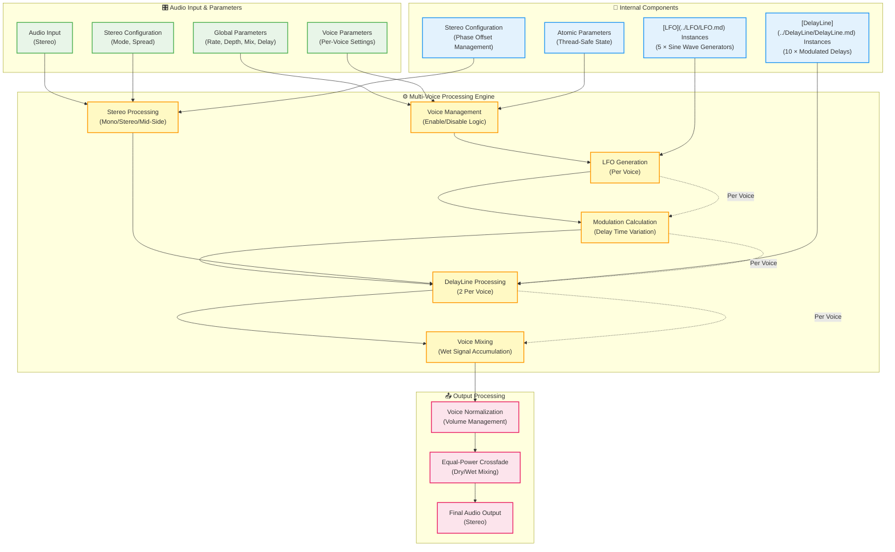

# Chorus - Documentation

## Overview

> **📋 Component Dependencies**  
> This Chorus effect is built using the [**LFO**](../LFO/LFO.md) and [**DelayLine**](../DelayLine/DelayLine.md) components. For detailed information about the underlying modulation and delay processing, please refer to their respective documentation.

The **Chorus** is a high-performance, multi-voice modulated delay effect designed for professional audio applications. It creates the characteristic "chorus" sound by combining the original signal with multiple delayed and modulated copies, simulating the natural variations that occur when multiple performers play the same part.

**Think of a chorus as multiple musicians playing the same melody** with slight timing and pitch variations. The Chorus effect recreates this by using modulated delay lines that continuously vary the pitch and timing of the delayed signal, creating movement, width, and richness in the audio.

### Key Features
- **Multi-voice architecture** with configurable maximum voices (1-16, default 5)
- **Dual LFO system** with independent left/right (or mid/side) LFOs per voice for advanced control
- **Integrated [LFO](../LFO/LFO.md) and [DelayLine](../DelayLine/DelayLine.md) components** for seamless modulation and delay processing
- **Three stereo processing modes**: Mono, Stereo, and Mid-Side for different spatial effects
- **Independent Mid-Side LFO control** for professional mastering applications
- **Per-voice parameter control** with both global and independent LFO settings
- **LFO linking system** for backward compatibility and simplified control
- **Thread-safe design** for real-time audio processing
- **Equal-power crossfading** for smooth dry/wet mixing without volume drops
- **Intelligent voice normalization** to prevent volume buildup with multiple voices
- **Advanced modulation scaling** to prevent artifacts at low delay times

### Common Applications
- **Classic Chorus**: Rich, shimmering effect for guitars, keyboards, and vocals
- **Ensemble Effects**: Simulating string sections or vocal groups
- **Stereo Widening**: Creating spatial movement and width in mono sources
- **Vintage Character**: Emulating classic analog chorus units
- **Subtle Thickening**: Adding body and presence without obvious modulation
- **Creative Modulation**: Extreme settings for special effects and sound design

## Comprehensive Parameter Table

| Parameter | Type | Range/Options | Default | Description | Thread Safe | Control Methods |
|-----------|------|---------------|---------|-------------|-------------|-----------------|
| **Enabled** | `bool` | true/false | true | Enable/disable entire chorus effect | ✅ | `setEnabled()` |
| **Number of Voices** | `int` | 1-5 | 1 | Number of active modulated delay lines | ✅ | `setNumVoices()` |
| **Global Rate** | `float` | 0.1-2.0 Hz | 1.0 Hz | [LFO](../LFO/LFO.md) modulation rate for all voices | ✅ | `setRate()` |
| **Global Depth** | `float` | 0.0-1.0 | 0.5 | Modulation intensity for all voices | ✅ | `setDepth()` |
| **Global Mix** | `float` | 0.0-1.0 | 0.7 | Dry/wet balance for all voices | ✅ | `setMix()` |
| **Global Base Delay** | `float` | 10-100 ms | 30 ms | Base delay time for all voices | ✅ | `setBaseDelay()` |
| **Stereo Mode** | `StereoMode` | Mono/Stereo/MidSide | Mono | Spatial processing mode | ✅ | `setStereoMode()` |
| **Stereo Spread** | `float` | 0.0-1.0 | 0.5 | Amount of stereo/spatial effect | ✅ | `setStereoSpread()` |
| **Mid Enabled** | `bool` | true/false | true | Enable mid channel processing (M/S mode) | ✅ | `setMidEnabled()` |
| **Side Enabled** | `bool` | true/false | true | Enable side channel processing (M/S mode) | ✅ | `setSideEnabled()` |
| **Side Gain** | `float` | -20 to +20 dB | 0 dB | Side channel gain adjustment (M/S mode) | ✅ | `setSideGain()` |

### Per-Voice Parameters (Voice Index 0-4)

| Parameter | Type | Range/Options | Default | Description | Thread Safe | Control Methods |
|-----------|------|---------------|---------|-------------|-------------|-----------------|
| **Voice Enabled** | `bool` | true/false | Voice 0: true, Others: false | Enable/disable individual voice | ✅ | `setVoiceEnabled()` |
| **Voice Rate** | `float` | 0.1-2.0 Hz | 0.8 + (voice × 0.15) Hz | Individual [LFO](../LFO/LFO.md) rate per voice | ✅ | `setVoiceRate()` |
| **Voice Depth** | `float` | 0.0-1.0 | 0.5 | Individual modulation depth per voice | ✅ | `setVoiceDepth()` |
| **Voice Mix** | `float` | 0.0-1.0 | 0.5 - (voice × 0.1) | Individual dry/wet mix per voice | ✅ | `setVoiceMix()` |
| **Voice Base Delay** | `float` | 10-100 ms | 30 + (voice × 3) ms | Individual base delay per voice | ✅ | `setVoiceBaseDelay()` |
| **Voice Phase Offset** | `float` | 0-360° | voice × 72° | Individual [LFO](../LFO/LFO.md) phase offset per voice | ✅ | `setVoicePhaseOffset()` |

### Stereo Processing Modes (StereoMode enum)

| Mode | Index | Description | Use Cases | CPU Cost |
|------|-------|-------------|-----------|----------|
| `Mono` | 0 | Identical processing for all channels | Mono sources, CPU efficiency | Lowest |
| `Stereo` | 1 | Independent L/R channel phase offsets | Stereo widening, spatial movement | Medium |
| `MidSide` | 2 | Mid-Side matrix processing with independent M/S modulation | Advanced stereo imaging, mastering | Highest |

### Voice Configuration Defaults

| Voice | Rate (Hz) | Mix | Base Delay (ms) | Phase Offset (°) | Default State |
|-------|-----------|-----|-----------------|------------------|---------------|
| 0 | 0.8 | 0.5 | 30 | 0 | Enabled |
| 1 | 0.95 | 0.4 | 33 | 72 | Disabled |
| 2 | 1.1 | 0.3 | 36 | 144 | Disabled |
| 3 | 1.25 | 0.2 | 39 | 216 | Disabled |
| 4 | 1.4 | 0.1 | 42 | 288 | Disabled |

## Dual LFO System for Advanced Mid-Side Processing

### Architecture Overview

The Chorus features a revolutionary **dual LFO system** where each voice contains two independent LFO instances:
- **LFO[0]**: Controls left channel (or Mid channel in Mid-Side mode)  
- **LFO[1]**: Controls right channel (or Side channel in Mid-Side mode)

This architecture enables unprecedented control over spatial processing, particularly for professional mastering applications where independent Mid-Side modulation is essential.

### LFO Linking Modes

#### Linked Mode (Default)
- **Behavior**: Both LFOs use global voice parameters (rate, depth, phase offset)
- **Compatibility**: Maintains backward compatibility with existing presets
- **Use Case**: Traditional chorus effects, simple stereo processing
- **Control**: Single set of parameters controls both LFOs

#### Independent Mode (Advanced)
- **Behavior**: Each LFO has its own rate, depth, and phase offset parameters
- **Capability**: Enables different waveforms, rates, and modulation curves per channel
- **Use Case**: Advanced Mid-Side processing, creative sound design, mastering applications
- **Control**: Separate parameters for left/mid and right/side LFOs

### Mid-Side Processing Advantages

#### Independent Modulation Control
```cpp
// Example: Different modulation for Mid vs Side
chorus.setVoiceLFOLinked(0, false);              // Enable independent control
chorus.setVoiceLeftRate(0, 0.8f);                // Subtle Mid modulation  
chorus.setVoiceRightRate(0, 1.5f);               // More active Side modulation
chorus.setVoiceLeftDepth(0, 0.3f);               // Conservative Mid depth
chorus.setVoiceRightDepth(0, 0.8f);              // Dramatic Side depth
```

#### Professional Applications
- **Vocal Processing**: Stable center image with spatial Side enhancement
- **Mastering**: Independent Mid/Side chorus for different frequency ranges
- **Mix Bus Processing**: Center coherence with width enhancement
- **Creative Effects**: Asymmetric modulation for unique spatial movement

### Parameter Synchronization

When switching between modes:
- **Linking LFOs**: Independent parameters sync to global voice parameters
- **Unlinking LFOs**: Global parameters copied to independent parameters as starting values
- **Real-time Safe**: All parameter changes are thread-safe and glitch-free

## Configurable Voice Count Architecture

### Dynamic Voice Allocation

The Chorus supports **configurable maximum voice counts** set at construction time:
- **Range**: 1-16 voices maximum (constructor parameter)
- **Default**: 5 voices for backward compatibility
- **Memory**: Dynamic allocation scales with voice count
- **Performance**: CPU usage scales linearly with maximum voices

### Construction Examples

```cpp
// Different voice count configurations
Chorus simpleChorus(2);      // 2-voice chorus for basic stereo widening
Chorus standardChorus(5);    // Standard 5-voice chorus (default)
Chorus complexChorus(8);     // 8-voice chorus for rich ensemble effects
Chorus masteringChorus(12);  // 12-voice chorus for professional mastering
```

### Memory and Performance Scaling

| Max Voices | Memory Usage | Typical CPU | Use Case |
|------------|--------------|-------------|----------|
| 1-2 | ~17-34 KB | Low | Simple effects, mobile |
| 3-5 | ~52-86 KB | Medium | Standard applications |
| 6-8 | ~103-137 KB | High | Rich textures |
| 9-16 | ~154-274 KB | Very High | Professional/mastering |

### Voice Management

- **Active Voices**: Set via `setNumVoices(count)` up to maximum
- **Runtime Limit**: Cannot exceed constructor-defined maximum
- **Parameter Validation**: All voice indices checked against maximum
- **Thread Safety**: Voice count changes are atomic and safe

### Parameter Behavior Details

#### Voice Management
- **Single Voice (1)**: Simple chorus effect, lowest CPU usage
- **Dual Voice (2)**: Richer modulation, good balance of effect and efficiency
- **Triple Voice (3)**: Full chorus character, recommended for most applications
- **Quad Voice (4)**: Dense, ensemble-like effect
- **Penta Voice (5)**: Maximum richness, highest CPU usage

#### Modulation Depth Scaling
- **0.0**: No modulation (static delay)
- **0.5**: Moderate chorus effect (±2.5ms modulation at default settings)
- **1.0**: Maximum modulation (±5ms modulation at default settings)
- **Adaptive Scaling**: Automatically reduces modulation range for delays < 45ms to prevent artifacts

#### Mix Parameter (Equal-Power Crossfading)
- **0.0**: 100% dry signal, no chorus effect
- **0.5**: Equal mix of dry and wet signals (no volume drop)
- **1.0**: 100% wet signal, maximum chorus effect
- **Implementation**: Uses sine/cosine crossfading for constant energy

#### Stereo Spread Behavior
- **Mono Mode**: No stereo processing regardless of spread setting
- **Stereo Mode**: Phase offset between L/R channels (0° to ±180° max)
- **Mid-Side Mode**: Phase offset between Mid/Side channels (0° to ±180° max)
- **Non-linear Curve**: Square root scaling for more dramatic effects at lower values

## Performance Characteristics

### Memory Usage
- **Per Voice**: ~8.6 KB (2 [DelayLines](../DelayLine/DelayLine.md) + 1 [LFO](../LFO/LFO.md) + state variables)
- **5 Voices Total**: ~43 KB + overhead
- **Breakdown per Voice**:
  - 2 [DelayLines](../DelayLine/DelayLine.md): ~8 KB (4 KB each at default settings)
  - 1 [LFO](../LFO/LFO.md): ~4.3 KB (wavetable + state)
  - Voice state: ~200 bytes
- **Allocation**: Memory allocated once during `prepare()`, no runtime allocation

### CPU Usage
- **Per Voice Cost**: [LFO](../LFO/LFO.md) generation + 2 [DelayLine](../DelayLine/DelayLine.md) processes + modulation calculations
- **Single Voice**: ~45-70 CPU cycles per sample
- **Five Voices**: ~225-350 CPU cycles per sample
- **Efficient Modulation**: Direct bipolar LFO output eliminates mathematical transformations
- **Stereo Mode**: +10% CPU overhead for phase calculations
- **Mid-Side Mode**: +20% CPU overhead for matrix conversions
- **Scalability**: Suitable for multiple instances on modern processors

### Latency Characteristics
- **Processing Latency**: Zero additional latency beyond base delay time
- **Parameter Change Latency**: Immediate atomic updates for all parameters
- **Delay Smoothing**: 50ms (high delays) or 100ms (low delays) transition time
- **Voice Switching**: Immediate enable/disable with smooth transitions

### Thread Safety
- **Audio Thread**: Safe for `processBlock()` and all parameter getters
- **UI Thread**: Safe for all parameter setters and getters
- **Concurrent Access**: Multiple threads can safely read/write parameters simultaneously
- **Implementation**: Uses `std::atomic<>` for immediate parameters, [DelayLine](../DelayLine/DelayLine.md)/[LFO](../LFO/LFO.md) smoothing for gradual changes
- **No Locks**: Lock-free design prevents audio dropouts

### Precision and Accuracy
- **Delay Time Precision**: Inherited from [DelayLine](../DelayLine/DelayLine.md) (double-precision, sample-accurate)
- **LFO Precision**: Inherited from [LFO](../LFO/LFO.md) (1024-sample wavetables, ~0.35° phase resolution)
- **Modulation Accuracy**: Linear interpolation ensures smooth pitch variations
- **Phase Accuracy**: ±0.1° precision for stereo/mid-side phase offsets

## Technical Implementation

The Chorus implementation is built around a multi-voice architecture that combines the [LFO](../LFO/LFO.md) and [DelayLine](../DelayLine/DelayLine.md) components to create rich, modulated delay effects. Each voice operates independently with its own [LFO](../LFO/LFO.md) and dual [DelayLine](../DelayLine/DelayLine.md) instances (for stereo processing), while global parameters provide unified control across all voices.

### Core Architecture Overview

The Chorus operates on a fundamental principle: multiple modulated delay lines running in parallel, each with slightly different parameters to create natural variation and movement. The system uses integrated [LFO](../LFO/LFO.md) instances to modulate the delay times, creating the characteristic pitch variations that define the chorus effect.

This approach delivers several critical advantages: independent voice control for complex textures, efficient resource sharing through common parameter updates, and flexible stereo processing modes for different spatial effects.

### Implementation Details

#### 1. Multi-Voice Architecture and Voice Management

The Chorus uses an array-based voice structure where each voice contains its own [LFO](../LFO/LFO.md) and dual [DelayLine](../DelayLine/DelayLine.md) instances:

```cpp
struct Voice {
    LFO lfo;
    std::array<DelayLine, 2> delayLines;  // [0] = left, [1] = right
    std::atomic<bool> enabled{false};
    std::atomic<float> rate{1.0f};
    std::atomic<float> depth{0.5f};
    std::atomic<float> mix{0.7f};
    std::atomic<float> baseDelay{30.0f};
    std::atomic<float> phaseOffset{0.0f};
    // ... additional state variables
};

std::array<Voice, 5> voices;  // Fixed array of 5 voices
```

**Voice Initialization Strategy:**
Each voice is initialized with slightly different default parameters to create natural variation:
- **Rate Variation**: 0.8, 0.95, 1.1, 1.25, 1.4 Hz (creating beating patterns)
- **Mix Variation**: 0.5, 0.4, 0.3, 0.2, 0.1 (decreasing contribution per voice)
- **Delay Variation**: 30, 33, 36, 39, 42 ms (preventing comb filtering)
- **Phase Variation**: 0°, 72°, 144°, 216°, 288° (equal distribution around circle)

#### 2. Modulation Mathematics and Signal Flow

Before examining the component coordination, it's essential to understand the exact mathematical equations that create the chorus effect. The modulation process involves several key transformations:

**Core Modulation Equation:**
```
modulatedDelay = baseDelay + LFO_output × modulationRange
```

**Step-by-Step Mathematical Breakdown:**

1. **LFO Output:**
   - LFO generates bipolar values in range [-1, 1]
   - Direct output ready for modulation

2. **Modulation Range Application:**
   - `modulationRange = depth × MAX_DELAY_MS × 0.001` (convert ms to seconds)
   - `modulation = LFO_output × modulationRange`
   - Result: modulation amount in seconds, ranging from -modulationRange to +modulationRange

3. **Final Delay Time Calculation:**
   - `modulatedDelay = baseDelay + modulation`
   - Where baseDelay is in seconds (baseDelayMs × 0.001)

**Example with Numbers:**
- Base delay: 30ms (0.030 seconds)
- Depth: 0.5 (50%)
- MAX_DELAY_MS: 10ms
- LFO output: 0.5 (range [-1, 1])

Calculations:
1. `modulationRange = 0.5 × 10 × 0.001 = 0.005 seconds`
2. `modulation = 0.5 × 0.005 = 0.0025 seconds`
3. `modulatedDelay = 0.030 + 0.0025 = 0.0325 seconds (32.5ms)`

**Phase Offset Mathematics (Stereo/Mid-Side modes):**
```
phasedLFO = baseLFO + (phaseOffset_degrees / 360.0)
phasedLFO = fmod(phasedLFO, 1.0)  // Wrap to [0,1] range
if (phasedLFO < 0) phasedLFO += 1.0  // Handle negative wrap
```

**Non-Linear Modulation Scaling (Stereo/Mid-Side modes):**
```
modulation = sign(modulation) × |modulation|^1.2
```
This power function (exponent 1.2) reduces the modulation amount for small values while preserving larger modulations, creating smoother pitch variations.

#### 3. Integrated Component Coordination

The Chorus coordinates between [LFO](../LFO/LFO.md) and [DelayLine](../DelayLine/DelayLine.md) components through careful parameter management and sample-by-sample processing:

```cpp
 // Per-voice processing loop
 for (int sample = 0; sample < numSamples; ++sample) {
     // Get LFO value for this sample (range [-1, 1])
     float lfoValue = voice.lfo.getNextSample();
     
     // Calculate modulated delay time
     float modulationRange = voice.depth.load() * MAX_DELAY_MS * 0.001f;
     float modulatedDelay = voice.baseDelay.load() * 0.001f + lfoValue * modulationRange;
     
     // Process through delay lines
     voice.delayLines[channel].setDelayTime(modulatedDelay);
     float delayedSample = voice.delayLines[channel].processSample(0, inputSample);
 }
```

The system ensures tight coupling between [LFO](../LFO/LFO.md) modulation and delay processing, with each sample receiving the current [LFO](../LFO/LFO.md) value to create smooth, continuous modulation.

#### 4. Stereo Processing Modes Implementation

The Chorus supports three distinct stereo processing modes, each with different computational and sonic characteristics:

 **Mono Mode Processing:**

In mono mode, the Chorus processes all audio channels identically, creating a unified chorus effect without any stereo imaging. This mode operates by running each enabled voice through a three-level nested loop structure: voices → samples → channels. For each voice, the system generates a single LFO modulation value per audio sample, then applies this exact same modulation to both the left and right DelayLine instances. This ensures that both channels receive identical delay modulation, preserving the original stereo image while adding the characteristic chorus movement.

The processing flow begins by validating the audio buffer, then iterating through each of the 5 potential voices (processing only those that are enabled). For each voice, the system processes every audio sample individually, generating a fresh LFO value that determines the instantaneous delay time. The LFO provides direct bipolar output (range [-1, 1]), which is multiplied by the modulation range and added to the base delay time. Both left and right channels receive this identical modulated delay time, ensuring mono compatibility while creating the desired pitch and timing variations that characterize the chorus effect.

 ```cpp
 void Chorus::processVoicesMono(juce::AudioBuffer<float>& buffer, juce::AudioBuffer<float>& wetBuffer) {
     const int numSamples = buffer.getNumSamples();
     const int numChannels = buffer.getNumChannels();
     
     if (numSamples <= 0 || numChannels <= 0) {
         return;
     }
     
     // Process each enabled voice
     for (int voiceIndex = 0; voiceIndex < MAX_VOICES; ++voiceIndex) {
         Voice& voice = voices[voiceIndex];
         
         if (!voice.enabled.load()) {
             continue;
         }
         
         // Process each sample for this voice
         for (int sample = 0; sample < numSamples; ++sample) {
             // Get LFO value for this sample
             float lfoValue = voice.lfo.getNextSample();
             
             // Calculate modulated delay time
             float modulationRange = voice.depth.load() * MAX_DELAY_MS * 0.001f; // Convert to seconds
             float modulatedDelay = voice.baseDelay.load() * 0.001f + lfoValue * modulationRange;
             
             // Clamp delay time to valid range
             modulatedDelay = std::max(0.001f, std::min(modulatedDelay, 0.1f)); // 1ms to 100ms
             
             // Get input samples for both channels
             const float* channelData[2] = { buffer.getReadPointer(0), buffer.getReadPointer(numChannels > 1 ? 1 : 0) };
             float* wetData[2] = { wetBuffer.getWritePointer(0), wetBuffer.getWritePointer(numChannels > 1 ? 1 : 0) };
             
             // Process each channel with identical settings
             for (int channel = 0; channel < 2; ++channel) {
                 voice.delayLines[channel].setDelayTime(modulatedDelay);
                 float delayedSample = voice.delayLines[channel].processSample(0, channelData[channel][sample]);
                 wetData[channel][sample] += delayedSample * voice.mix.load();
             }
         }
     }
 }
 ```

 **Stereo Mode Processing:**

Stereo mode creates spatial movement and width by applying different phase-shifted LFO modulation to the left and right channels. This mode uses the same three-level nested loop structure as mono mode, but introduces channel-specific phase offsets that create independent delay modulation for each channel. The key innovation is that while both channels use the same base LFO waveform from each voice, they apply different phase offsets (leftPhaseOffset and rightPhaseOffset) to create complementary but different modulation patterns.

The processing begins similarly to mono mode with buffer validation and voice iteration, but includes an intelligent adaptive modulation scaling system that reduces modulation depth for short base delays (< 45ms) to prevent audible artifacts. For each sample, the system generates one base LFO value per voice, then calculates two different phase-shifted versions—one for the left channel and one for the right channel. These phase-shifted LFO values are converted to modulation amounts and applied to create independent delay times for each channel.

The stereo effect is enhanced by non-linear modulation scaling using a power function (exponent 1.2) that creates smoother pitch variations and more musical modulation curves. Each channel's DelayLine receives its own unique modulated delay time, causing the left and right channels to have slightly different pitch and timing variations. This creates the characteristic stereo movement where sounds seem to shift position in the stereo field, adding width and spatial interest to the audio.

 ```cpp
 void Chorus::processVoicesStereo(juce::AudioBuffer<float>& buffer, juce::AudioBuffer<float>& wetBuffer) {
     const int numSamples = buffer.getNumSamples();
     const int numChannels = buffer.getNumChannels();
     
     if (numSamples <= 0 || numChannels <= 0) {
         return;
     }
     
     // Process each enabled voice
     for (int voiceIndex = 0; voiceIndex < MAX_VOICES; ++voiceIndex) {
         Voice& voice = voices[voiceIndex];
         
         if (!voice.enabled.load()) {
             continue;
         }
         
         // Get base delay and calculate modulation parameters
         float baseDelayMs = voice.baseDelay.load();
         float modulationRange = voice.depth.load() * MAX_DELAY_MS * 0.001f; // Convert to seconds
         
         // Adjust modulation range based on base delay to prevent artifacts
         if (baseDelayMs < 45.0f) {
             // Reduce modulation range for low base delays
             float scaleFactor = juce::jmap(baseDelayMs, 10.0f, 45.0f, 0.4f, 1.0f);
             modulationRange *= scaleFactor;
         }
         
         // Process each sample for this voice
         for (int sample = 0; sample < numSamples; ++sample) {
             // Get base LFO value for this sample
             float baseLfoValue = voice.lfo.getNextSample();
             
             // Get input samples for both channels
             const float* channelData[2] = { buffer.getReadPointer(0), buffer.getReadPointer(1) };
             float* wetData[2] = { wetBuffer.getWritePointer(0), wetBuffer.getWritePointer(1) };
             
             // Process each channel with phase-shifted LFO values
             for (int channel = 0; channel < 2; ++channel) {
                 // Calculate phase-shifted LFO value for this channel
                 float phaseOffset = (channel == 0) ? voice.leftPhaseOffset : voice.rightPhaseOffset;
                 float phasedLfoValue = baseLfoValue + (phaseOffset / 360.0f);
                 
                 // Wrap to [0, 1] range
                 phasedLfoValue = std::fmod(phasedLfoValue, 1.0f);
                 if (phasedLfoValue < 0.0f) phasedLfoValue += 1.0f;
                 
                 // Calculate delay time for this channel
                 float baseDelaySec = baseDelayMs * 0.001f;
                 float modulation = phasedLfoValue * modulationRange;
                 
                 // Apply non-linear modulation scaling for smoother pitch variations
                 modulation = std::copysign(std::pow(std::abs(modulation), 1.2f), modulation);
                 
                 float channelDelay = baseDelaySec + modulation;
                 
                 // Clamp delay time to valid range
                 channelDelay = std::max(0.001f, std::min(channelDelay, 0.1f)); // 1ms to 100ms
                 
                 // Update delay time and process sample
                 voice.delayLines[channel].setDelayTime(channelDelay);
                 float delayedSample = voice.delayLines[channel].processSample(0, channelData[channel][sample]);
                 
                 // Add to wet buffer
                 wetData[channel][sample] += delayedSample * voice.mix.load();
             }
         }
     }
 }
 ```

 **Mid-Side Mode Processing:**

Mid-Side mode provides the most sophisticated stereo processing by converting the stereo signal into Mid (center) and Side (stereo difference) components, processing them independently, then converting back to left-right stereo. This mode offers precise control over the center image versus the stereo width components of the audio, making it particularly valuable for mastering applications and advanced stereo imaging.

The processing begins with a matrix conversion that transforms the incoming left-right stereo signal into mid-side format: Mid = Left + Right (the sum, representing center content) and Side = Left - Right (the difference, representing stereo width information). Each voice then processes these Mid and Side signals independently, using separate phase offsets (midPhaseOffset and sidePhaseOffset) to create different modulation patterns for each component.

The system allows selective processing where either the Mid channel, Side channel, or both can be enabled independently. When processing the Side channel, an additional configurable gain control (sideGainDb) allows for precise adjustment of the stereo width contribution, converted from decibels to linear gain. After all voices have processed both Mid and Side components, the system performs the inverse matrix conversion to transform the processed Mid-Side signal back to Left-Right stereo: Left = (Mid + Side) / 2 and Right = (Mid - Side) / 2. This approach provides unprecedented control over the spatial characteristics of the chorus effect, allowing for effects that can enhance center content differently from stereo width content.

 ```cpp
 void Chorus::processVoicesMidSide(juce::AudioBuffer<float>& buffer, juce::AudioBuffer<float>& wetBuffer) {
     // Convert L/R to M/S
     for (int sample = 0; sample < numSamples; ++sample) {
         float left = buffer.getSample(0, sample);
         float right = buffer.getSample(1, sample);
         float mid = left + right;    // Mid = L + R
         float side = left - right;   // Side = L - R
     }
     
     // Process each enabled voice
     for (int voiceIndex = 0; voiceIndex < MAX_VOICES; ++voiceIndex) {
         Voice& voice = voices[voiceIndex];
         if (!voice.enabled.load()) continue;
         
         // Get base LFO value and modulation parameters
         float baseLfoValue = voice.lfo.getNextSample();
         float modulationRange = voice.depth.load() * MAX_DELAY_MS * 0.001f;
         
         // Process mid channel (channel 0) if enabled
         if (midEnabled) {
             float phaseOffset = voice.midPhaseOffset;
             float phasedLfoValue = baseLfoValue + (phaseOffset / 360.0f);
             phasedLfoValue = std::fmod(phasedLfoValue, 1.0f);
             if (phasedLfoValue < 0.0f) phasedLfoValue += 1.0f;
             
             float modulation = phasedLfoValue * modulationRange;
             float midDelay = (voice.baseDelay.load() * 0.001f) + modulation;
             midDelay = std::max(0.001f, std::min(midDelay, 0.1f));
             
             voice.delayLines[0].setDelayTime(midDelay);
             float delayedSample = voice.delayLines[0].processSample(0, midSideData[0][sample]);
             midSideWetData[0][sample] += delayedSample * voice.mix.load();
         }
         
         // Process side channel (channel 1) if enabled
         if (sideEnabled) {
             float phaseOffset = voice.sidePhaseOffset;
             float phasedLfoValue = baseLfoValue + (phaseOffset / 360.0f);
             phasedLfoValue = std::fmod(phasedLfoValue, 1.0f);
             if (phasedLfoValue < 0.0f) phasedLfoValue += 1.0f;
             
             float modulation = phasedLfoValue * modulationRange;
             float sideDelay = (voice.baseDelay.load() * 0.001f) + modulation;
             sideDelay = std::max(0.001f, std::min(sideDelay, 0.1f));
             
             voice.delayLines[1].setDelayTime(sideDelay);
             float delayedSample = voice.delayLines[1].processSample(0, midSideData[1][sample]);
             
             // Apply configurable side gain (dB to linear conversion)
             float sideGainLinear = std::pow(10.0f, sideGainDb / 20.0f);
             midSideWetData[1][sample] += delayedSample * voice.mix.load() * sideGainLinear;
         }
     }
     
     // Convert processed M/S back to L/R
     float wetLeft = (finalMid + finalSide) * 0.5f;   // L = (M + S) / 2
     float wetRight = (finalMid - finalSide) * 0.5f;  // R = (M - S) / 2
 }
 ```

#### 5. Advanced Modulation Scaling and Artifact Prevention

The Chorus implements intelligent modulation scaling to prevent artifacts that can occur with low base delay times:

```cpp
// Adaptive modulation range scaling
if (baseDelayMs < 45.0f) {
    // Reduce modulation range for low base delays to prevent artifacts
    float scaleFactor = juce::jmap(baseDelayMs, 10.0f, 45.0f, 0.4f, 1.0f);
    modulationRange *= scaleFactor;
}

// Non-linear modulation scaling for smoother pitch variations
modulation = std::copysign(std::pow(std::abs(modulation), 1.2f), modulation);
```

This approach prevents the "warbling" artifacts that can occur when delay times are modulated too heavily at short delays, while maintaining the characteristic chorus sound.

#### 6. Equal-Power Crossfading Implementation

The mixing algorithm uses equal-power crossfading to maintain consistent loudness across all mix settings:

```cpp
// Equal Power crossfade ensures constant energy across the mix range
float dryMix = std::cos(mixValue * juce::MathConstants<float>::halfPi);
float wetMix = std::sin(mixValue * juce::MathConstants<float>::halfPi);

// Apply the crossfade
channelData[sample] = channelData[sample] * dryMix + wetChannelData[sample] * wetMix;
```

This eliminates the common volume drop that occurs at 50% mix with linear crossfading, ensuring consistent perceived loudness across the entire mix range.

#### 7. Voice Normalization and Volume Management

The system implements intelligent normalization to prevent volume buildup when multiple voices are active:

```cpp
// Count active voices
int activeVoiceCount = 0;
for (int i = 0; i < MAX_VOICES; ++i) {
    if (voices[i].enabled.load()) {
        activeVoiceCount++;
    }
}

// Apply logarithmic normalization
float logNormalization = 1.0f / (0.5f + std::log10(static_cast<float>(activeVoiceCount) + 0.5f));
```

The logarithmic normalization preserves more of the wet signal compared to linear normalization, maintaining the chorus character while preventing excessive volume buildup.

#### 8. Stereo Configuration Management

The stereo configuration system automatically calculates phase offsets based on the current stereo mode and spread setting:

```cpp
void Chorus::updateStereoConfiguration() {
    if (currentStereoMode == StereoMode::Stereo) {
        // Apply non-linear curve for more dramatic effect at lower values
        float spreadCurve = std::pow(stereoSpread, 0.5f);
        float maxPhaseOffset = spreadCurve * 360.0f;
        
        for (int i = 0; i < MAX_VOICES; ++i) {
            Voice& voice = voices[i];
            
            // Maximum separation: left = -180°, right = +180°
            voice.leftPhaseOffset = -maxPhaseOffset * 0.5f;
            voice.rightPhaseOffset = maxPhaseOffset * 0.5f;
            
            // Add slight offset per voice for richer stereo field
            float voiceSpread = (i * 15.0f) * spreadCurve;
            voice.leftPhaseOffset -= voiceSpread;
            voice.rightPhaseOffset += voiceSpread;
        }
    }
    // ... similar logic for Mid-Side mode
}
```

#### 9. Thread Safety and Parameter Management

Thread safety is achieved through a combination of atomic variables for immediate parameters and reliance on the underlying [LFO](../LFO/LFO.md) and [DelayLine](../DelayLine/DelayLine.md) thread-safe implementations:

```cpp
// Immediate parameters (atomic)
std::atomic<float> rate{1.0f};
std::atomic<float> depth{0.5f};
std::atomic<float> mix{0.7f};
std::atomic<bool> enabled{true};

// Per-voice parameters (atomic)
struct Voice {
    std::atomic<bool> enabled{false};
    std::atomic<float> rate{1.0f};
    std::atomic<float> depth{0.5f};
    // ... other atomic parameters
};
```

Parameter changes are applied immediately to atomic variables, while smoothing occurs within the [LFO](../LFO/LFO.md) and [DelayLine](../DelayLine/DelayLine.md) components as needed.

#### 10. Performance Optimization Techniques

Several optimization techniques ensure efficient real-time performance:

**Memory Access Optimization:**
- Fixed-size arrays prevent dynamic allocation during processing
- Sequential processing of voices improves cache locality
- Atomic variables grouped together to minimize cache misses

**Computational Optimization:**
- Modulation calculations performed once per sample per voice
- Phase offset calculations cached during configuration updates
- Non-linear modulation scaling uses efficient power functions

**Algorithm Optimization:**
```cpp
// Efficient phase wrapping
phasedLfoValue = std::fmod(phasedLfoValue, 1.0f);
if (phasedLfoValue < 0.0f) phasedLfoValue += 1.0f;

// Fast delay time clamping
modulatedDelay = std::max(0.001f, std::min(modulatedDelay, 0.1f));
```

### System Integration Diagram



This comprehensive technical implementation covers every aspect of the Chorus's operation, from the multi-voice architecture through advanced features like stereo processing modes, adaptive modulation scaling, and performance optimization. The implementation provides a complete understanding of how the Chorus achieves rich, professional-quality chorus effects suitable for a wide range of musical applications.
