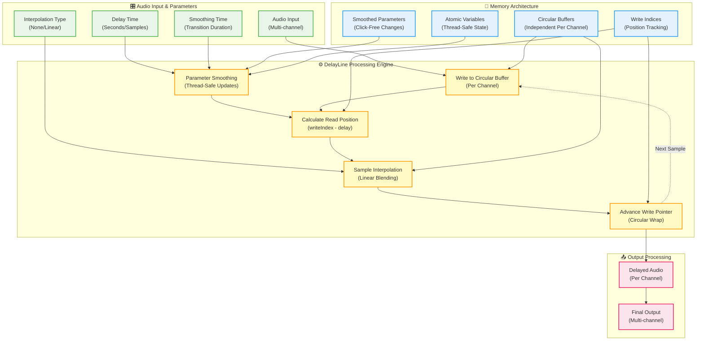

# DelayLine - Documentation

## Overview

The **DelayLine** is a high-performance, thread-safe audio delay processor designed for professional audio applications. It creates echoes, reverbs, chorus effects, and other time-based audio effects using a circular buffer approach with linear interpolation for smooth, artifact-free delay processing.

The DelayLine captures audio samples and plays them back after a specified delay time, enabling a wide range of creative and corrective audio processing applications. It supports multiple channels simultaneously and provides precise delay time control with smooth parameter transitions to prevent audio artifacts.

### Key Features
- **Circular buffer architecture** for efficient memory usage and constant-time operations
- **Linear interpolation** for smooth fractional delay times and artifact-free modulation
- **Multi-channel support** with independent processing per channel
- **Thread-safe parameter updates** for real-time control without audio dropouts
- **Smooth delay time changes** with configurable smoothing to prevent clicks
- **Sample-accurate timing** with double-precision delay time control
- **Memory-efficient design** with predictable memory allocation
- **Zero-latency processing** with no additional algorithmic delay

### Common Applications
- **Echo/Delay Effects**: Creating distinct repetitions with feedback and filtering
- **Reverb Building Blocks**: Multiple DelayLines form the basis of algorithmic reverbs
- **Chorus/Flanger**: Short, modulated delays create spatial movement and thickness
- **Doubling/Thickening**: Very short delays (10-30ms) add width without obvious delay
- **Slap-back Echo**: Classic 50-150ms delays for vintage character
- **Comb Filtering**: Very short delays (1-20ms) create resonant filtering effects

## Comprehensive Parameter Table

| Parameter | Type | Range/Options | Default | Description | Thread Safe | Control Methods |
|-----------|------|---------------|---------|-------------|-------------|-----------------|
| **Sample Rate** | `double` | > 0 Hz | 44100 Hz | Audio sample rate (set once during prepare) | ⚠️ | `prepare()` only |
| **Max Delay Time** | `double` | > 0 seconds | N/A | Maximum possible delay (set once during prepare) | ⚠️ | `prepare()` only |
| **Num Channels** | `int` | > 0 | N/A | Number of audio channels (set once during prepare) | ⚠️ | `prepare()` only |
| **Current Delay** | `double` | 0 to max seconds | 0.0 | Active delay time with smoothing | ✅ | `setDelayTime()` |
| **Delay in Samples** | `double` | 0 to max samples | 0.0 | Active delay in samples (fractional) | ✅ | `setDelayInSamples()` |
| **Smoothing Time** | `double` | ≥ 0 seconds | 0.05 | Delay change smoothing duration | ✅ | `setSmoothingTime()` |
| **Interpolation Type** | `InterpolationType` | None/Linear | Linear | Sample interpolation method | ✅ | `setInterpolationType()` |

### InterpolationType Enum

| Value | Index | Description | CPU Cost | Audio Quality | Use Cases |
|-------|-------|-------------|----------|---------------|-----------|
| `None` | 0 | Nearest sample (no interpolation) | Lowest | Basic | Static delays, CPU-limited scenarios |
| `Linear` | 1 | Linear interpolation between samples | Low | High | Modulated delays, professional applications |

### Initialization Parameters (prepare method)

| Parameter | Type | Constraints | Description | Memory Impact |
|-----------|------|-------------|-------------|---------------|
| `sampleRate` | `double` | > 0 Hz | Audio sample rate | Determines buffer sizes |
| `maxDelayTimeInSeconds` | `double` | > 0 seconds | Maximum delay capability | Directly affects memory usage |
| `numChannels` | `int` | > 0 channels | Number of independent audio channels | Multiplies memory usage |

### Memory Usage Calculator

| Sample Rate | Max Delay | Channels | Buffer Size (samples) | Memory Usage | Typical Use Case |
|-------------|-----------|----------|----------------------|--------------|------------------|
| 44.1 kHz | 1 second | Stereo | 88,200 | ~353 KB | Standard delay effects |
| 48 kHz | 1 second | Stereo | 96,000 | ~384 KB | Professional delay effects |
| 48 kHz | 2 seconds | Stereo | 192,000 | ~768 KB | Long echo effects |
| 96 kHz | 1 second | 5.1 (6ch) | 576,000 | ~2.3 MB | High-resolution surround delays |
| 48 kHz | 0.1 second | Stereo | 9,600 | ~38 KB | Chorus/flanger effects |
| 48 kHz | 0.05 second | Mono | 2,400 | ~10 KB | Comb filtering |

**Memory Formula**: `(sampleRate × maxDelayTime × numChannels × 4 bytes) + overhead`

### Parameter Behavior Details

#### Delay Time Parameters
- **setDelayTime()**: Sets delay in seconds with automatic smoothing to prevent clicks
- **setDelayInSamples()**: Sets delay in samples for precise control, supports fractional values
- **setDelayTimeImmediate()**: Sets delay instantly without smoothing (use with caution during playback)

#### Smoothing Behavior
- **Default smoothing**: 50ms transition time for delay changes
- **Zero smoothing**: Instant changes (may cause clicks if used during audio playback)
- **Custom smoothing**: Adjustable from 0ms to any duration for specific applications

#### Interpolation Impact
- **None**: CPU-efficient but may cause artifacts with modulated delay times
- **Linear**: Minimal CPU overhead with high-quality output for all applications

## Performance Characteristics

### Memory Usage
- **Per Channel**: `sampleRate × maxDelayTime × 4 bytes` (32-bit float samples)
- **Total Memory**: `numChannels × perChannelSize + ~200 bytes overhead`
- **Allocation Strategy**: Single allocation during `prepare()`, no runtime allocations
- **Memory Pattern**: Contiguous circular buffers for optimal cache performance

### CPU Usage
- **Per Sample Cost**: 1 buffer write + 1 buffer read + optional interpolation + pointer advancement
- **Linear Interpolation**: Adds ~2-3 CPU cycles per sample (1 multiply, 1 add, 1 subtract)
- **No Interpolation**: ~5-8 CPU cycles per sample on modern processors
- **Multi-channel Scaling**: Linear scaling with channel count (independent processing)
- **Typical Performance**: Suitable for dozens of simultaneous DelayLine instances

### Latency Characteristics
- **Processing Latency**: Zero additional latency beyond the specified delay time
- **Parameter Change Latency**: Immediate atomic updates for all parameters
- **Smoothing Latency**: Gradual delay time changes over the specified smoothing period
- **Buffer Latency**: No additional buffering beyond the circular delay buffer

### Thread Safety
- **Multi-channel Processing**: Safe to process different channels from different threads
- **Parameter Updates**: All parameter setters are thread-safe using atomic operations
- **Concurrent Access**: Multiple threads can safely read parameters while others write
- **Same Channel Limitation**: Do not process the same channel from multiple threads simultaneously
- **Implementation**: Uses `juce::SmoothedValue` for delay time smoothing and atomic operations

### Precision and Accuracy
- **Delay Time Precision**: Double-precision floating-point (64-bit) for delay time storage
- **Sample Accuracy**: Supports fractional sample delays with linear interpolation
- **Maximum Precision**: Limited by floating-point precision (~15 decimal digits)
- **Timing Accuracy**: Sample-accurate delay times with no drift or accumulation errors

## Technical Implementation

The DelayLine implementation is built around a circular buffer architecture that provides efficient, constant-time audio delay processing. The system uses independent circular buffers for each audio channel, with atomic parameter updates and optional linear interpolation for high-quality output.

### Core Architecture Overview

The DelayLine operates on a fundamental principle: circular buffers that store audio samples in a ring configuration. Write and read pointers advance through these buffers at different rates, with the distance between them determining the delay time. This approach provides constant-time performance regardless of delay length and eliminates the need for data copying or buffer shifting.

The circular buffer design delivers several critical advantages: predictable memory usage independent of current delay time, constant CPU cost per sample regardless of delay length, and efficient cache utilization through sequential memory access patterns.

### Implementation Details

#### 1. Circular Buffer Architecture and Memory Management

The DelayLine uses independent circular buffers for each audio channel, with each buffer sized to accommodate the maximum specified delay time:

```cpp
std::vector<std::vector<float>> delayBuffers;  // One buffer per channel
std::vector<int> writeIndices;                 // Write position per channel
std::vector<juce::SmoothedValue<double>> smoothedDelayInSamples;  // Smoothed delay per channel
```

**Buffer Sizing Calculation:**
```cpp
void DelayLine::prepare(double sampleRate, double maxDelayTimeInSeconds, int numChannels) {
    // Calculate buffer size with safety margin
    int bufferSize = static_cast<int>(std::ceil(sampleRate * maxDelayTimeInSeconds)) + 1;
    
    // Allocate circular buffers for each channel
    delayBuffers.resize(numChannels);
    for (auto& buffer : delayBuffers) {
        buffer.resize(bufferSize, 0.0f);  // Initialize with silence
    }
    
    // Initialize write indices and smoothed delay values
    writeIndices.resize(numChannels, 0);
    smoothedDelayInSamples.resize(numChannels);
    for (auto& smoothed : smoothedDelayInSamples) {
        smoothed.reset(sampleRate, smoothingTimeInSeconds);
        smoothed.setCurrentAndTargetValue(0.0);
    }
}
```

The buffer size includes a safety margin to handle edge cases and ensure robust operation. Each buffer is initialized with silence to prevent artifacts when the DelayLine is first used. The circular nature means that when the write pointer reaches the end of the buffer, it wraps around to the beginning, creating a continuous ring of audio data.

#### 2. Write and Read Pointer Management

The DelayLine maintains separate write and read positions for each channel. The write pointer advances with each new input sample, while the read pointer is calculated dynamically based on the current delay time:

```cpp
float DelayLine::processSample(int channel, float inputSample) {
    // Write input sample to circular buffer
    delayBuffers[channel][writeIndices[channel]] = inputSample;
    
    // Calculate read position based on current delay
    double delayInSamples = smoothedDelayInSamples[channel].getNextValue();
    double readPosition = writeIndices[channel] - delayInSamples;
    
    // Handle negative read positions (wrap around buffer)
    while (readPosition < 0.0) {
        readPosition += delayBuffers[channel].size();
    }
    
    // Get delayed sample with interpolation
    float delayedSample = getInterpolatedSample(channel, readPosition);
    
    // Advance write pointer with circular wrap
    writeIndices[channel] = (writeIndices[channel] + 1) % delayBuffers[channel].size();
    
    return delayedSample;
}
```

The read position calculation subtracts the delay time (in samples) from the current write position. When this results in a negative position, the calculation wraps around the buffer by adding the buffer size, maintaining the circular buffer behavior.

#### 3. Linear Interpolation Implementation

Linear interpolation is essential for achieving smooth, artifact-free output when the read position falls between discrete buffer samples. This is particularly important for modulated delays and fractional delay times:

```cpp
float DelayLine::getInterpolatedSample(int channel, double readPosition) {
    if (interpolationType == InterpolationType::None) {
        // Nearest sample (no interpolation)
        int index = static_cast<int>(std::round(readPosition));
        return delayBuffers[channel][index % delayBuffers[channel].size()];
    }
    
    // Linear interpolation
    int index1 = static_cast<int>(std::floor(readPosition));
    int index2 = (index1 + 1) % delayBuffers[channel].size();
    double fraction = readPosition - index1;
    
    float sample1 = delayBuffers[channel][index1];
    float sample2 = delayBuffers[channel][index2];
    
    return sample1 + static_cast<float>(fraction) * (sample2 - sample1);
}
```

The interpolation process calculates a weighted average between two adjacent samples based on the fractional portion of the read position. When the read position is exactly at a buffer index (fraction = 0), the output equals the first sample. When the position is between samples, the output is a proportional blend of both samples.

#### 4. Delay Time Smoothing Mechanism

Smooth delay time changes are crucial for preventing audio artifacts when delay parameters are modified during playback. The DelayLine uses JUCE's SmoothedValue class to interpolate between old and new delay times:

```cpp
void DelayLine::setDelayTime(double delayTimeInSeconds) {
    double delayInSamples = delayTimeInSeconds * sampleRate;
    
    // Clamp to valid range
    delayInSamples = std::clamp(delayInSamples, 0.0, maxDelayInSamples);
    
    // Set target for smooth interpolation
    for (auto& smoothed : smoothedDelayInSamples) {
        smoothed.setTargetValue(delayInSamples);
    }
}
```

The smoothing occurs over a configurable time period (typically 50ms) and happens entirely within the audio processing thread. Each call to `getNextValue()` returns a slightly different delay time, creating a gradual transition that prevents audible clicks or artifacts.

#### 5. Multi-Channel Processing Architecture

Each audio channel maintains its own independent circular buffer and processing state, enabling true multi-channel operation without cross-channel interference:

```cpp
void DelayLine::processBlock(juce::AudioBuffer<float>& buffer) {
    const int numChannels = buffer.getNumChannels();
    const int numSamples = buffer.getNumSamples();
    
    for (int channel = 0; channel < numChannels; ++channel) {
        float* channelData = buffer.getWritePointer(channel);
        
        for (int sample = 0; sample < numSamples; ++sample) {
            float input = channelData[sample];
            float delayed = processSample(channel, input);
            channelData[sample] = delayed;  // Replace with delayed signal
        }
    }
}
```

This architecture allows for different delay times per channel, independent parameter control, and the possibility of processing different channels on different threads (though the same channel should not be processed concurrently from multiple threads).

#### 6. Memory Layout Optimization

The DelayLine's memory layout is optimized for cache efficiency and minimal allocation overhead:

**Buffer Organization:**
- Contiguous memory allocation for each circular buffer
- Sequential access patterns during normal operation
- Minimal pointer dereferencing in the audio processing loop

**Cache Efficiency Strategies:**
- Circular buffers sized to fit efficiently in CPU cache when possible
- Write operations use sequential memory access
- Read operations typically access recently written data (temporal locality)

```cpp
// Memory layout visualization for stereo DelayLine:
// Channel 0: [sample0][sample1][sample2]...[sampleN]
// Channel 1: [sample0][sample1][sample2]...[sampleN]
// Write indices: [writeIdx0][writeIdx1]
// Smoothed delays: [smoothed0][smoothed1]
```

#### 7. Thread Safety Implementation

Thread safety is achieved through careful design of the data structures and access patterns:

**Safe Operations:**
- Multiple threads can safely process different channels simultaneously
- Parameter updates use atomic operations where necessary
- SmoothedValue provides thread-safe interpolation within the audio thread

**Thread Safety Mechanisms:**
```cpp
// Atomic parameter updates
std::atomic<InterpolationType> interpolationType{InterpolationType::Linear};
std::atomic<double> smoothingTimeInSeconds{0.05};

// Thread-safe smoothed values (used only in audio thread)
std::vector<juce::SmoothedValue<double>> smoothedDelayInSamples;
```

**Restrictions:**
- The same channel must not be processed from multiple threads simultaneously
- Buffer reallocation (via `prepare()`) should not occur during audio processing
- Parameter changes are safe but may take effect gradually due to smoothing

#### 8. Performance Optimization Techniques

Several optimization techniques ensure the DelayLine operates efficiently in real-time audio applications:

**Computational Optimizations:**
- Modulo operations use efficient bit-masking where buffer sizes are powers of 2
- Floating-point to integer conversions use fast truncation methods
- Branch prediction optimization in interpolation code paths

**Memory Access Optimizations:**
- Sequential write access patterns for optimal cache utilization
- Read access patterns typically exhibit good temporal locality
- Minimal memory allocations after initialization

**Algorithm Optimizations:**
```cpp
// Optimized circular buffer index advancement
writeIndex = (writeIndex + 1) & (bufferSize - 1);  // When bufferSize is power of 2

// Efficient read position wrapping
while (readPos < 0.0) readPos += bufferSize;  // Typically executes once or not at all
```

### System Integration Diagram



This comprehensive technical implementation covers every aspect of the DelayLine's operation, from the fundamental circular buffer architecture through advanced features like multi-channel processing, thread safety, and performance optimization. The implementation provides a complete understanding of how the DelayLine achieves efficient, high-quality audio delay processing suitable for professional audio applications.
