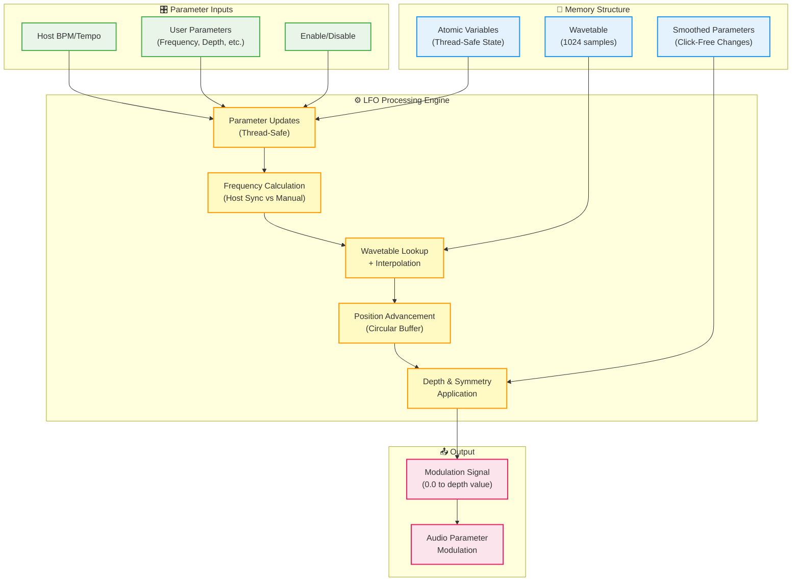

# LFO (Low Frequency Oscillator) - Documentation

## Overview

The **LFO (Low Frequency Oscillator)** is a high-performance, thread-safe audio modulation source designed for professional audio applications. It generates periodic waveforms at low frequencies (0.001 Hz to 1000 Hz) to modulate audio parameters like delay time, filter cutoff, amplitude, pitch, or any other controllable parameter.

**Think of an LFO as a "musical robot hand"** that automatically turns knobs for you in predictable, rhythmic patterns. Instead of manually adjusting parameters, the LFO does it automatically at the speed and pattern you choose, creating movement and life in your audio.

### Key Features
- **7 different waveform types** for varied modulation characteristics
- **Thread-safe design** for real-time audio processing
- **Host tempo synchronization** with musical divisions (1/2 note to 1/16 note)
- **Wavetable-based generation** for consistent CPU performance
- **Smooth parameter changes** to prevent audio clicks
- **Phase offset control** for stereo and multi-voice effects
- **Symmetry control** for asymmetric waveforms
- **Enable/disable functionality** for easy bypass

### Common Applications
- **Chorus/Flanger**: Modulating delay time creates spatial movement
- **Tremolo**: Modulating amplitude creates rhythmic volume changes
- **Vibrato**: Modulating pitch creates expressive pitch variations
- **Filter Sweeps**: Modulating filter cutoff creates sweeping effects
- **Auto-Panning**: Modulating stereo position creates movement between speakers

## Comprehensive Parameter Table

| Parameter | Type | Range/Options | Default | Description | Thread Safe | Control Methods |
|-----------|------|---------------|---------|-------------|-------------|-----------------|
| **Enabled** | `bool` | true/false | true | Enable/disable LFO processing | ✅ | `setEnabled()`, `updateParameters()` |
| **Frequency** | `double` | 0.001 - 1000 Hz | 1.0 Hz | Speed of oscillation (cycles per second) | ✅ | `setFrequency()`, `updateParameters()` |
| **Depth** | `float` | 0.0 - 1.0 | 1.0 | Modulation intensity (smoothed) | ✅ | `setDepth()`, `updateParameters()` |
| **Wave Shape** | `WaveformType` | 0-6 (7 types) | 0 (Sine) | Shape of the waveform | ✅ | `setWaveShape()`, `updateParameters()` |
| **Phase Offset** | `double` | 0 - 2π radians | 0.0 | Starting position offset | ✅ | `setPhaseOffset()`, `updateParameters()` |
| **Symmetry** | `float` | 0.1 - 0.9 | 0.5 | Time distribution (smoothed) | ✅ | `setSymmetry()`, `updateParameters()` |
| **Invert** | `bool` | true/false | false | Flip waveform upside down | ✅ | `setInvert()`, `updateParameters()` |
| **Sync to Host** | `bool` | true/false | false | Lock to DAW tempo | ✅ | `setSyncToHost()`, `updateParameters()` |
| **Sync Rate** | `int` | 0-5 (6 divisions) | 1 (1/4 Note) | Musical timing division | ✅ | `setSyncRate()`, `updateParameters()` |
| **Coupling** | `CouplingType` | DC/AC | DC | Output coupling type (set once at init) | ✅ | `setCoupling()`, `getCoupling()` |

### Coupling Types (CouplingType enum)

| Value | Index | Output Range | Description | Use Cases |
|-------|-------|--------------|-------------|-----------|
| `DC` | 0 | [0, 1] | DC coupling (unipolar) | Traditional LFO applications, legacy compatibility |
| `AC` | 1 | [-1, 1] | AC coupling (bipolar) | Direct modulation without offset/scaling, chorus effects |

### Waveform Types (WaveformType enum)

| Value | Index | Shape | Mathematical Description |
|-------|-------|-------|-------------------------|
| `Sine` | 0 | Smooth, curved oscillation | `sin(2π * position)` |
| `RampDown` | 1 | Quick rise, slow fall | Exponential decay curve |
| `RampUp` | 2 | Slow rise, quick fall | Exponential attack curve |
| `Square` | 3 | Alternating high/low with smooth transitions | Square wave with rounded edges |
| `Triangle` | 4 | Linear ramps up and down | Triangular wave with linear slopes |
| `HumpDown` | 5 | U-shaped (valley pattern) | Inverted parabolic curve |
| `HumpUp` | 6 | Inverted U (peak pattern) | Parabolic curve |

### Host Sync Divisions (syncRate parameter)

| Index | Division | Cycles per Beat | Frequency at 120 BPM | Frequency at 140 BPM |
|-------|----------|-----------------|---------------------|---------------------|
| 0 | 1/2 Note | 0.5 | 1.0 Hz | 1.17 Hz |
| 1 | 1/4 Note | 1.0 | 2.0 Hz | 2.33 Hz |
| 2 | 1/4 Triplet | 1.33 | 2.67 Hz | 3.11 Hz |
| 3 | 1/8 Note | 2.0 | 4.0 Hz | 4.67 Hz |
| 4 | 1/8 Triplet | 2.67 | 5.33 Hz | 6.22 Hz |
| 5 | 1/16 Note | 4.0 | 8.0 Hz | 9.33 Hz |

### Parameter Behavior Details

#### Enabled Parameter
- When `false`: LFO outputs 0.0 regardless of other settings
- When `true`: LFO processes normally according to other parameters
- **Use case**: Temporary bypass without losing parameter settings

#### Depth Parameter
- **0.0**: No modulation effect (LFO outputs 0.0)
- **0.5**: 50% modulation intensity (LFO outputs 0.0 to 0.5)
- **1.0**: Full modulation intensity (LFO outputs 0.0 to 1.0)
- **Smoothing**: Changes are smoothed over 50ms to prevent clicks

#### Symmetry Parameter
- **0.5 (50%)**: Normal symmetric waveform
- **0.3 (30%)**: First half compressed (quick), second half expanded (slow)
- **0.7 (70%)**: First half expanded (slow), second half compressed (quick)
- **Smoothing**: Changes are smoothed over 50ms to prevent clicks

#### Phase Offset
- **0.0**: Waveform starts at beginning of cycle
- **π (180°)**: Waveform starts at middle of cycle (inverted phase)
- **π/2 (90°)**: Waveform starts at quarter point
- **Use case**: Creating stereo effects or synchronizing multiple LFOs

#### Coupling Parameter
- **DC Coupling**: Output range [0, 1] (default)
  - Traditional LFO behavior for backward compatibility
  - Requires offset/scaling for bipolar modulation: `(lfo - 0.5) * 2.0`
- **AC Coupling**: Output range [-1, 1] (bipolar)
  - Direct bipolar output without mathematical transformation
  - Simplifies modulation calculations: `baseValue + lfo * modulationRange`
  - Recommended for new applications and chorus effects
- **Performance Note**: Coupling type should be set once during initialization for optimal performance

## Performance Characteristics

### Memory Usage
- **Wavetable**: 1024 samples × 4 bytes = **4.096 KB** per LFO instance
- **State Variables**: Approximately **200 bytes** per instance
- **Total Memory**: **~4.3 KB per LFO instance** (very lightweight)
- **Allocation**: Memory allocated once during `prepare()`, no runtime allocation

### CPU Usage
- **Per Sample Cost**: 1 wavetable lookup + 1 linear interpolation + position advancement
- **Typical Performance**: **~10-15 CPU cycles per sample** on modern processors
- **Comparison**: Extremely efficient vs. real-time mathematical calculation (sin/cos functions)
- **Scalability**: Suitable for **dozens of simultaneous LFO instances**

### Latency Characteristics
- **Processing Latency**: **Zero additional latency** (direct lookup)
- **Parameter Change Latency**: Immediate (atomic updates)
- **Smoothing Latency**: 50ms smoothing time for depth and symmetry changes
- **Host Sync Latency**: Responds immediately to host tempo changes

### Thread Safety
- **Audio Thread**: Safe for `getNextSample()`, `getCurrentSample()`, all parameter setters
- **UI Thread**: Safe for all parameter setters and getters
- **Concurrent Access**: Multiple threads can safely read/write parameters simultaneously
- **Implementation**: Uses `std::atomic<>` variables and JUCE's `SmoothedValue<>`
- **No Locks**: Lock-free design prevents audio dropouts

### Precision and Accuracy
- **Wavetable Resolution**: 1024 samples per cycle
- **Phase Accuracy**: ~0.35° resolution (360° / 1024 samples)
- **Frequency Accuracy**: Limited by sample rate and wavetable size
- **Interpolation**: Linear interpolation between wavetable samples for smooth output

## Technical Implementation

The LFO implementation is built around a wavetable-based architecture that prioritizes performance, thread safety, and audio quality. Rather than computing waveforms mathematically in real-time, the system pre-calculates waveform data and uses efficient lookup mechanisms to generate output samples.

### Core Architecture Overview

The LFO operates on a fundamental principle: a circular buffer (wavetable) containing 1024 pre-calculated sample values representing one complete cycle of the desired waveform. A position pointer advances through this table at a rate determined by the frequency parameter, with linear interpolation providing smooth output between discrete table positions.

This approach delivers several critical advantages: consistent CPU usage regardless of waveform complexity, elimination of expensive trigonometric calculations during audio processing, and predictable real-time performance suitable for professional audio applications.

### Implementation Details

#### 1. Wavetable Generation and Storage

The LFO uses a **pre-calculated wavetable approach** rather than computing waveforms in real-time. Here's the detailed process:

```cpp
// Wavetable is a fixed-size array of 1024 float values
static constexpr size_t DEFAULT_WAVETABLE_SIZE = 1024;
std::vector<float> waveTable;
```

**Why 1024 samples?**
- **Power of 2**: Enables efficient bit-shifting operations
- **Good Resolution**: Provides ~0.35° phase resolution (360° / 1024)
- **Memory Efficient**: Only 4KB per wavetable
- **CPU Cache Friendly**: Fits comfortably in L1 cache

**Wavetable Generation Process:**

1. **Initialize Array**: Create array of 1024 float values
2. **Generate Base Waveform**: Calculate mathematical function for each sample point
3. **Apply Symmetry**: Modify time distribution based on symmetry parameter
4. **Apply Inversion**: Flip waveform if invert flag is set
5. **Normalize Range**: Ensure all values are in [0, 1] range

```cpp
void LFO::initializeWaveTable() {
    const float symmetry = smoothedSymmetry.getCurrentValue();
    const bool shouldInvert = invert.load();
    const WaveformType shape = waveShape.load();
    
    for (size_t i = 0; i < DEFAULT_WAVETABLE_SIZE; ++i) {
        // Calculate normalized position [0, 1]
        float position = static_cast<float>(i) / static_cast<float>(DEFAULT_WAVETABLE_SIZE);
        
        // Apply symmetry transformation
        float adjustedPosition = applySymmetry(position, symmetry);
        
        // Generate waveform sample
        float sample = generateWaveformSample(adjustedPosition, shape);
        
        // Apply inversion if enabled
        if (shouldInvert) {
            sample = 1.0f - sample;
        }
        
        waveTable[i] = sample;
    }
}
```

#### 2. Position Tracking and Increment Calculation

The position tracking system maintains the current location within the wavetable and calculates the advancement rate for each audio sample. The position is stored as a floating-point value, allowing for precise fractional positions that enable smooth frequency control and high-quality interpolation.

```cpp
std::atomic<float> position{0.0f};      // Current position in wavetable
std::atomic<double> increment{0.0};     // How much to advance per sample
```

The increment value determines how quickly the position advances through the wavetable. This value is calculated based on the relationship between the desired LFO frequency, the audio sample rate, and the wavetable size:

```cpp
void LFO::updateIncrement() {
    double sampleRate = this->sampleRate.load();
    double freq = getEffectiveFrequency(); // Handles host sync vs manual frequency
    
    // Calculate how many wavetable samples to advance per audio sample
    increment.store((freq * DEFAULT_WAVETABLE_SIZE) / sampleRate);
}
```

The mathematical relationship ensures that the LFO completes exactly the specified number of cycles per second. For example, at 48kHz sample rate with a 1Hz LFO frequency and 1024-sample wavetable, the increment equals approximately 0.0213, meaning the position advances about 2.13% through the wavetable with each audio sample. Over 48,000 audio samples (one second), this results in exactly one complete cycle through the wavetable.

#### 3. Sample Generation Process

Every audio sample, the LFO generates its output through this process:

```cpp
float LFO::getNextSample() {
    // Early exit if disabled
    if (!enabled.load()) {
        return 0.0f;
    }
    
    // Get current position and increment
    float currentPos = position.load();
    double currentIncrement = increment.load();
    
    // Calculate integer and fractional parts for interpolation
    float exactIndex = currentPos;
    int index1 = static_cast<int>(exactIndex);
    int index2 = (index1 + 1) % DEFAULT_WAVETABLE_SIZE;
    float fraction = exactIndex - static_cast<float>(index1);
    
    // Linear interpolation between adjacent samples
    float sample1 = waveTable[index1];
    float sample2 = waveTable[index2];
    float interpolatedSample = sample1 + fraction * (sample2 - sample1);
    
    // Apply depth scaling
    float depth = smoothedDepth.getNextValue();
    float output = interpolatedSample * depth;
    
    // Advance position with wraparound
    float newPosition = currentPos + static_cast<float>(currentIncrement);
    if (newPosition >= DEFAULT_WAVETABLE_SIZE) {
        newPosition -= DEFAULT_WAVETABLE_SIZE;
    }
    position.store(newPosition);
    
    return output;
}
```

#### 4. Linear Interpolation Implementation

Linear interpolation is essential for maintaining audio quality when the position pointer lands between discrete wavetable samples. Without interpolation, the output would exhibit stepping artifacts and aliasing, particularly at lower frequencies where the increment values are small.

The interpolation process calculates a weighted average between two adjacent wavetable samples based on the fractional portion of the current position:

```
output = sample1 + fraction × (sample2 - sample1)
```

This formula provides a smooth transition between samples. When the position is exactly at a wavetable index (fraction = 0), the output equals the first sample. When the position is exactly between two samples (fraction = 0.5), the output is the average of both samples. The fractional component determines the weighting between adjacent samples, ensuring smooth, artifact-free output across all frequency ranges.

#### 5. Host Synchronization Implementation

When `syncToHost` is enabled, the LFO frequency is calculated from the host's BPM and selected musical division:

```cpp
double LFO::getEffectiveFrequency() const {
    if (!syncToHost.load()) {
        return frequency.load(); // Manual frequency mode
    }
    
    // Host sync mode
    double bpm = hostBPM.load();
    int syncIndex = syncRateIndex.load();
    
    // Musical divisions (cycles per beat)
    static const double divisions[] = {0.5, 1.0, 1.33, 2.0, 2.67, 4.0};
    
    if (bpm > 0.0 && syncIndex >= 0 && syncIndex < 6) {
        // Convert BPM to beats per second, then apply division
        double beatsPerSecond = bpm / 60.0;
        return beatsPerSecond * divisions[syncIndex];
    }
    
    return frequency.load(); // Fallback to manual frequency
}
```

#### 6. Symmetry Implementation

The symmetry feature modifies the temporal distribution of the waveform by applying a non-linear transformation to the position lookup. This creates asymmetric waveforms where different portions of the cycle occupy different amounts of time, enabling more expressive modulation patterns.

```cpp
float LFO::applySymmetry(float position, float symmetry) {
    // Symmetry of 0.5 = no change (symmetric)
    // Symmetry < 0.5 = first half compressed, second half expanded
    // Symmetry > 0.5 = first half expanded, second half compressed
    
    if (position <= symmetry) {
        // First half: scale to [0, 0.5]
        return (position / symmetry) * 0.5f;
    } else {
        // Second half: scale to [0.5, 1.0]
        return 0.5f + ((position - symmetry) / (1.0f - symmetry)) * 0.5f;
    }
}
```

The symmetry transformation divides the waveform cycle into two segments at the symmetry point. The first segment (0 to symmetry) is mapped to the first half of the waveform (0 to 0.5), while the second segment (symmetry to 1.0) is mapped to the second half (0.5 to 1.0). When symmetry equals 0.5, both segments have equal duration, producing a symmetric waveform. Values below 0.5 compress the first half and expand the second half, while values above 0.5 do the opposite, creating distinctive attack and decay characteristics.

#### 7. Thread Safety Implementation Details

Thread safety is achieved through a combination of atomic variables for immediate parameter updates and smoothed values for parameters that require gradual transitions to prevent audio artifacts.

```cpp
std::atomic<bool> enabled{true};
std::atomic<double> frequency{1.0};
std::atomic<WaveformType> waveShape{WaveformType::Sine};
std::atomic<bool> invert{false};
std::atomic<double> phaseOffset{0.0};
std::atomic<bool> syncToHost{false};
std::atomic<int> syncRateIndex{1};
std::atomic<float> position{0.0f};
std::atomic<double> increment{0.0};
```

Parameters that can change instantly without causing audio artifacts use atomic variables, providing lock-free access from multiple threads. The audio processing thread can read these values safely while the UI thread updates them, with no risk of data races or audio dropouts.

```cpp
juce::SmoothedValue<float> smoothedDepth;
juce::SmoothedValue<float> smoothedSymmetry;
```

Parameters that would cause audible clicks if changed abruptly use JUCE's SmoothedValue class. These parameters interpolate smoothly between old and new values over a configurable time period (typically 50ms), ensuring seamless parameter transitions during audio playback. The smoothing occurs entirely within the audio thread, maintaining real-time safety while providing artifact-free parameter changes.

#### 8. Waveform Generation Algorithms

Each waveform type uses a specific mathematical approach:

**Sine Wave:**
```cpp
float generateSine(float position) {
    return 0.5f + 0.5f * std::sin(2.0f * M_PI * position);
}
```

**Triangle Wave:**
```cpp
float generateTriangle(float position) {
    if (position < 0.5f) {
        return 2.0f * position;  // Rising edge
    } else {
        return 2.0f * (1.0f - position);  // Falling edge
    }
}
```

**Square Wave (with rounded corners):**
```cpp
float generateSquare(float position) {
    // Use tanh for smooth transitions instead of hard edges
    float phase = 2.0f * M_PI * position;
    return 0.5f + 0.5f * std::tanh(8.0f * std::sin(phase));
}
```

#### 9. Performance Optimizations

**Memory Layout:**
- Wavetable stored as contiguous array for cache efficiency
- Atomic variables grouped together to minimize cache misses
- SmoothedValue objects handle their own interpolation efficiently

**CPU Optimizations:**
- Pre-calculated wavetables eliminate expensive math functions
- Linear interpolation uses simple arithmetic (one multiply, one add)
- Modulo operations use efficient bit masking where possible
- Position wraparound uses conditional subtraction instead of modulo

**Cache Efficiency:**
- 4KB wavetable fits in L1 cache on most processors
- Sequential access pattern during wavetable generation
- Minimal memory allocations after initialization

### System Integration Diagram


